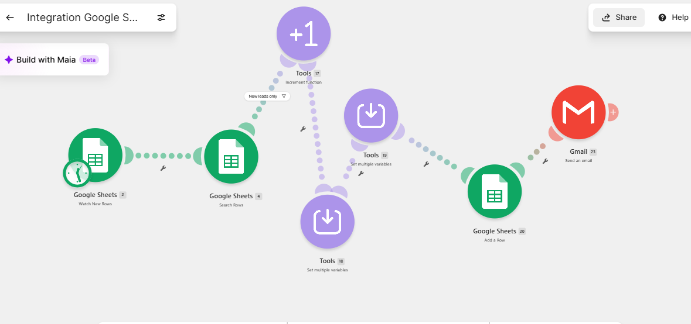

# Lead Capture and CRM Routing (Make.com)

An automated lead-capture pipeline built in Make.com. When a new
lead is submitted, the scenario checks for duplicates, assigns a
unique ID, scores and routes the lead by budget, writes it to a
CRM sheet, and emails the right salesperson, all with no manual
handling.

## What it does

- **Captures new leads** the moment they land in the intake sheet
- **Prevents duplicates** by checking each lead against the CRM
  before adding it
- **Assigns a sequential lead ID** so every record is uniquely
  traceable
- **Scores the lead** from its budget, service, and industry
- **Routes by budget**: higher-value leads go to a senior
  consultant, the rest to a sales rep
- **Writes the lead to the CRM** with its status, owner, and score
- **Emails the assigned salesperson** automatically so no lead
  sits unseen

## How it works

The scenario runs as a chain of modules:

1. **Watch New Rows** on the intake sheet triggers the scenario
2. **Search Rows** checks the CRM for an existing match (duplicate
   guard)
3. A **filter** ("New leads only") stops the flow if the lead
   already exists
4. An **Increment Function** generates the next sequential lead ID
5. **Set Variables (1)** computes the lead score and lead ID
6. **Set Variables (2)** routes the lead: status, owner, and email
7. **Add a Row** writes the finished record to the CRM sheet
8. **Gmail** notifies the assigned salesperson

| Component | Choice |
|---|---|
| Platform | Make.com |
| Data store | Google Sheets (intake + CRM) |
| Notifications | Gmail |
| Routing logic | Budget-based, via switch expressions |

## Key lessons

**Route on a field that always has a value.** An early version
routed on lead score, but leads whose service or industry were not
covered by the scoring expressions fell through to a zero default
and all landed in the same queue. Switching the routing to the
budget field, which is always present, made it reliable.

**Variables that depend on each other need two steps.** A variable
cannot reference another variable being set in the same module, so
the scoring and the routing were split across two Set Variables
modules.

**Filters live on the connection, not in the module list.** In
Make, the duplicate-guard filter sits on the line between two
modules, which is easy to miss when first building.

## Note on credentials

No API keys or personal email addresses are included. Connection
credentials are stored in Make, not in the exported blueprint. The
spreadsheet ID and routing emails are placeholders. Import the
blueprint, connect your own Google and Gmail accounts, and replace
the placeholders before running.
