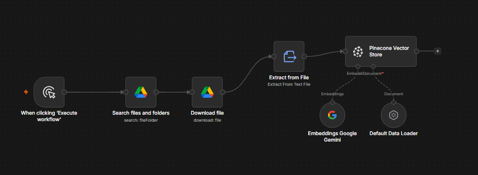
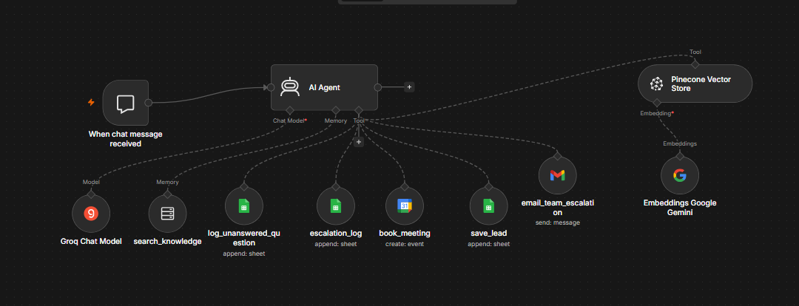

# AI Customer Service System (RAG + Agents)

A complete AI customer service system for a logistics business,
built in n8n. It answers customer questions from the company's own
documents, captures and qualifies leads, books virtual meetings,
and escalates to a human when needed. One assistant runs the whole
enquiry desk.

## What it does

- **Answers from documents (RAG)**: retrieves relevant passages
  from a vector database and answers only from real company
  information, instead of inventing answers
- **Remembers the conversation**: keeps context across messages,
  so follow-up questions make sense
- **Captures leads**: collects each customer's name, phone, and
  email into a Google Sheet
- **Qualifies leads**: categorises each as a Serious or Unserious
  lead based on buying signals (pricing, volume, timelines, or a
  specific need)
- **Books virtual meetings**: creates a Google Meet link and adds
  the event to both calendars, respecting weekdays and office
  hours
- **Escalates to a human**: when it cannot help or the customer
  asks for a person, it logs the details and emails the team
- **Improves itself**: logs every unanswered question, so the team
  knows what content to add to the knowledge base

## Architecture

The system is built as two workflows that share one vector
database.

**1. Ingestion (run when documents change)**
Google Drive → download documents → extract clean text →
split into chunks → generate embeddings → store in Pinecone.

**2. The assistant (runs on every message)**
A chat trigger feeds an AI Agent that decides which of its tools
to use: search the knowledge base, save a lead, book a meeting,
escalate to a human, or log an unanswered question.

| Component | Choice |
|---|---|
| Automation | n8n |
| Vector database | Pinecone |
| Embeddings | Google Gemini (gemini-embedding-001) |
| Chat model | Groq (Llama 3.3 70B) |
| Integrations | Google Drive, Sheets, Calendar, Gmail |

## The assistant's tools

| Tool | Purpose |
|---|---|
| search_knowledge | Answer questions from company documents |
| save_lead | Capture and qualify a lead to a sheet |
| book_meeting | Create a Google Meet event on both calendars |
| escalate_to_human | Log and email the team for human follow-up |
| log_unanswered_question | Record questions the docs could not answer |

## Setup

1. Import both workflows into n8n
2. Add credentials: Google (Drive, Sheets, Calendar, Gmail),
   Pinecone, and a chat model key
3. Create a Pinecone index matching your embedding model's
   dimensions (3072 for gemini-embedding-001), metric cosine
4. Put your documents in a Google Drive folder as Google Docs
5. Run the ingestion workflow to load your documents
6. Create the supporting sheets: Leads, Escalations, and
   Unanswered Questions
7. Test each capability, then publish

## Key lessons

**RAG lives or dies on clean text.** The hardest part was not the
AI, it was extracting readable text from the source files.
Documents arriving as binary, or split into useless fragments,
produced garbage in the database. A proper text-extraction and
chunking step was most of the work.

**Don't let AI do date maths.** The model kept booking meetings
for the wrong day or for "now." The fix was to pass exact ISO 8601
timestamps to the calendar rather than letting the model calculate
dates. Let AI handle language; let deterministic tools handle
anything precise.

**More tools demand a clearer brain.** With several tools on one
agent, the system prompt matters more than the wiring. Precise
instructions on when to use each tool are what turn many
capabilities into reliable behaviour.

## Refreshing the knowledge base

When the source documents change, re-run the ingestion workflow so
the vector database reflects the updates. The assistant only knows
what has been ingested.

## Note on credentials

No API keys are included. n8n stores credentials separately from
the workflow files. Add your own before running.
